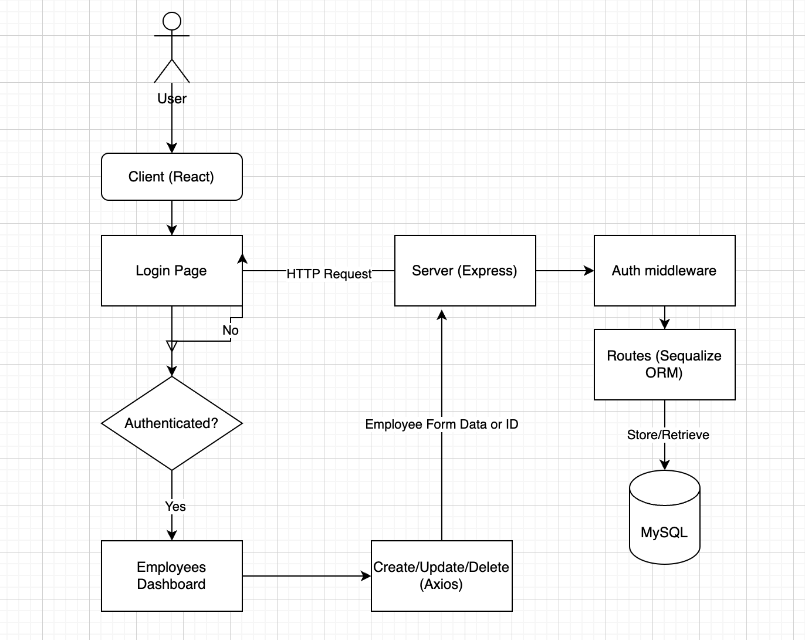
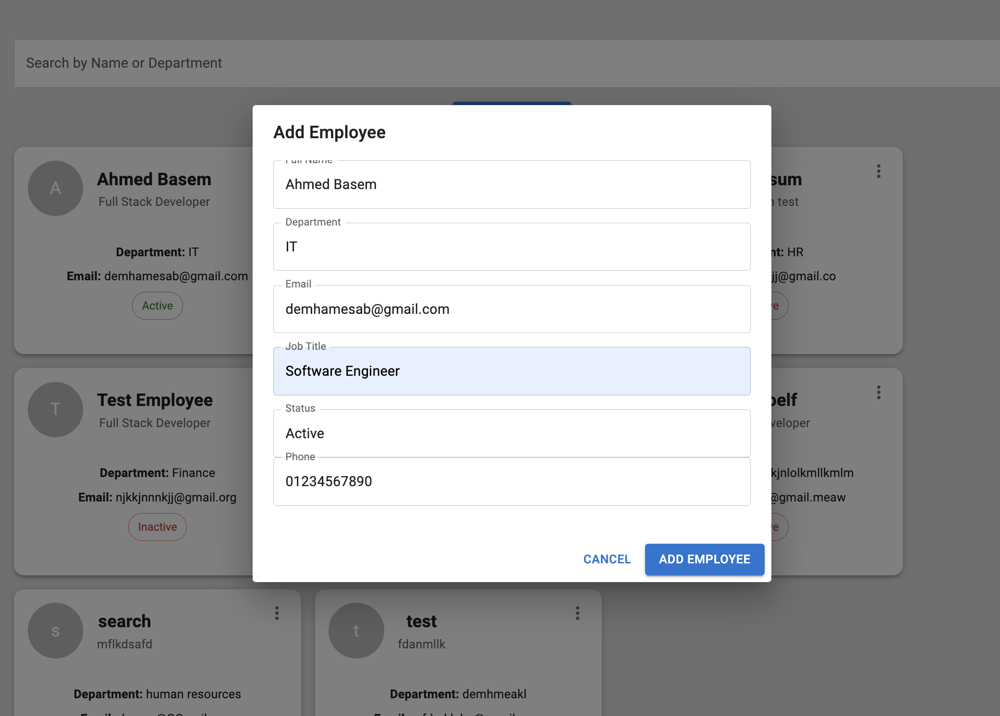
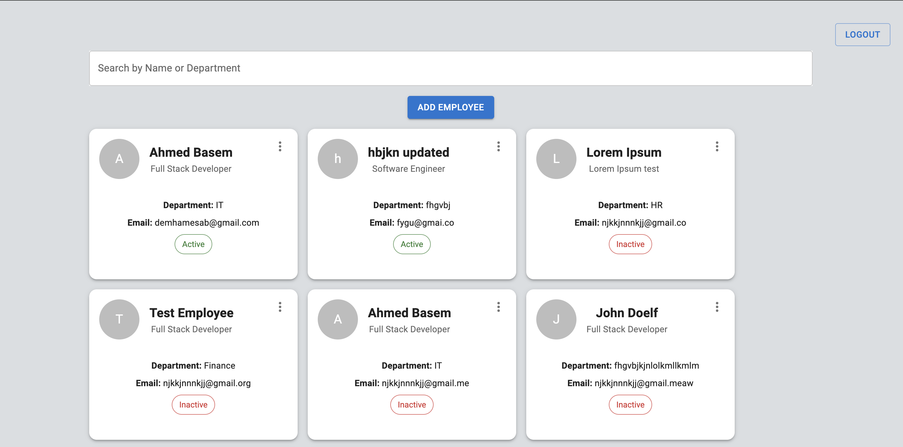

# Employee Management Dashboard

## Overview
A full-stack employee management system where users can log in, view employees, search, create, update, and delete employee records. The frontend is built with React (Vite, TypeScript, MUI), and the backend is developed using Express.js, Sequelize ORM, and MySQL.
## App Flow

## Tech Stack
### Frontend:
- **React**
- **Material UI**
- **Axios** 


### Backend:
- **Node.js + Express.js**
- **Sequelize ORM + MySQL**
- **JWT**
## Setup Instructions
### Backend setup

```
cd backend
npm install
node server.js
```

### Frontend Setup
On another terminal:

```
cd frontend
npm install
npm run dev
```

### Environment Variables
Backend `.env`
```env
DB_HOST=localhost
DB_USER=root
DB_PASSWORD=password
DB_NAME=db name
JWT_SECRET=jwtsecret
PORT=3307
```

## API Endpoints

Auth

POST /auth/login - User login (returns JWT)

Employees

GET /employees - Fetch all employees

POST /employees - Create a new employee

PUT /employees/:id - Update employee details

DELETE /employees/:id - Remove an employee

## Screenshots



