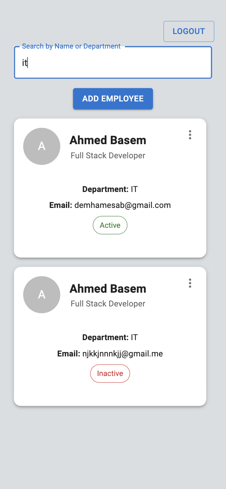

# Employee Management Dashboard

## Overview
A full-stack employee management system where users can log in, view employees, search, create, update, and delete employee records. The frontend is built with React (Vite, TypeScript, MUI), and the backend is developed using Express.js, Sequelize ORM, and MySQL.
## App Flow

## Tech Stack
### Frontend:
- **React**
- **Material UI**
- **Axios** 


### Backend:
- **Node.js + Express.js**
- **Sequelize ORM + MySQL**
- **JWT**
## Setup Instructions
**Note:** Make sure you have [Node.js](https://nodejs.org/en/download) and [MySQL](https://dev.mysql.com/downloads/mysql/) installed in your machine before starting.
### **1. Clone the repository**
```
git clone https://github.com/AhmedBasem20/Employee-Directory.git
cd Employee-Directory
```
### **2. Backend setup**

```
cd backend
npm install
```
Create a database using mysql cli or a tool like [MySQL Workbench](https://www.mysql.com/products/workbench/)
```
CREATE DATABASE database-name-here
```

**Create a `.env`` file in the backend directory:**
```env
DB_HOST=localhost
DB_USER=root
DB_PASSWORD=password
DB_NAME=db name
JWT_SECRET=jwtsecret
PORT=3307 # required
```

**Run the server**
```
node server.js
```

### 3. Frontend Setup
In another terminal, run:

```
cd frontend
npm install
npm run dev
```
Now the app will be running at `http://localhost:5173/`
Enter the following credentials when logging in:
```
Username: test
Password: test
```
## API Endpoints

Auth

POST /auth/login - User login (returns JWT)

Employees

GET /employees - Fetch all employees

POST /employees - Create a new employee

PUT /employees/:id - Update employee details

DELETE /employees/:id - Remove an employee

## Screenshots


